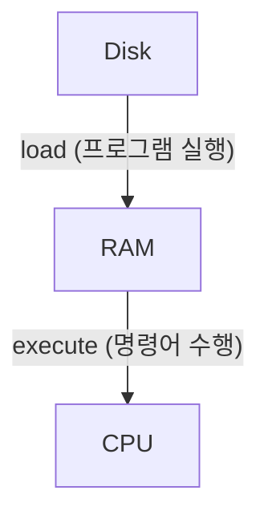

# Day 001 - 구조 다이어그램

## 코드 실행 흐름



- Disk: 코드와 데이터가 영구 저장되는 공간
- RAM: 실행 중인 코드와 데이터가 올라가는 공간
- CPU: RAM에 있는 명령어를 하나씩 실행하는 장치
- 속도: CPU > RAM >>> Disk

## 프로세스 메모리 구조

```text
[ Code ]
  - 함수 코드
  - 실행 명령어

[ Data ]
  - 전역 변수
  - static 변수

[ Heap ]
  - 객체
  - 배열
  - 동적 할당

[ Stack ]
  - 함수 호출
  - 지역 변수
  - 매개변수
```

## 함수 호출과 스택 프레임

```text
| sum frame       |
| a, b, result    |
|-----------------|
| main frame      |
| x               |
|-----------------|
```

## 콜스택(Call Stack) 예시

```text
| c() |
|-----|
| b() |
|-----|
| a() |
```

- 가장 위: 현재 실행 중인 함수
- 아래: 호출한 함수들