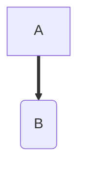

# Day 001 - 구조 다이어그램

## 코드 실행 흐름

```text
[ Disk ]
  |
  |  load (프로그램 실행)
  v
[ RAM ]
  |
  |  execute (명령어 수행)
  v
[ CPU ]
```

- Disk: 코드와 데이터가 영구 저장되는 공간
- RAM: 실행 중인 코드와 데이터가 올라가는 공간
- CPU: RAM에 있는 명령어를 하나씩 실행하는 장치
- 속도: CPU > RAM >>> Disk

## 프로세스 메모리 구조
- Code
- Data
- Heap
- Stack

mermaid 렌더링 테스트
